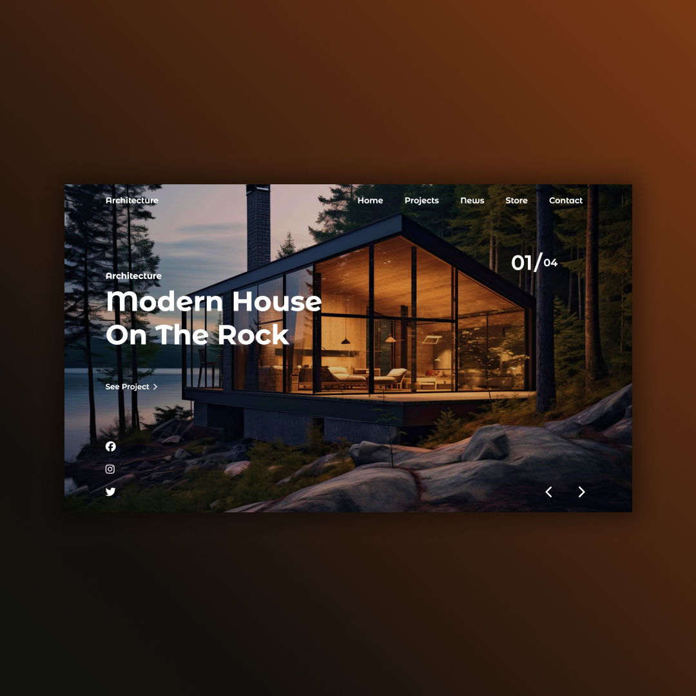
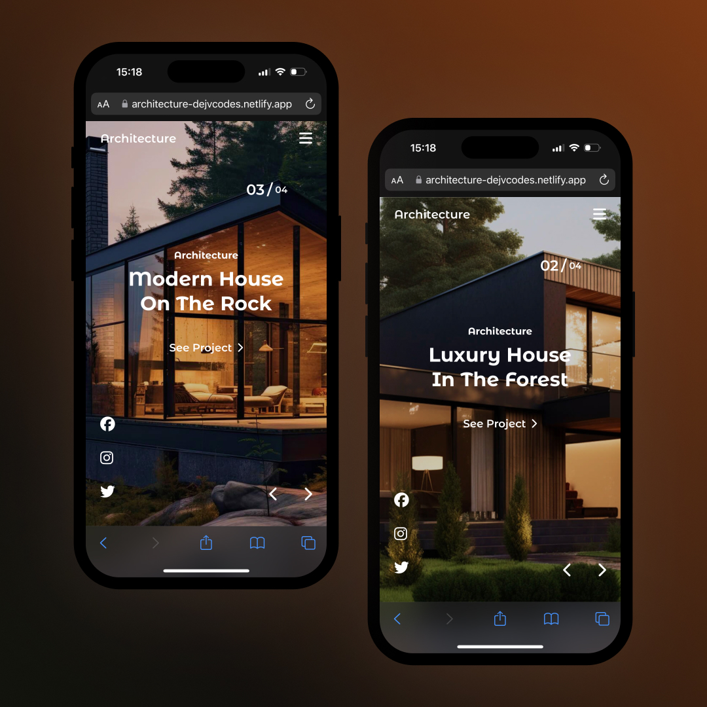

## Architecture Website 💡
• HTML, CSS and JavaScript 📂  
• Contains sliding images with the Swiper Js library. 🔁 
• Parallax animations in titles and images.  
• Responsive Design ✅

## Screenshots 📱
 

## 💻 Tech Stack

## 🌐 Link
<a href="https://architecture-dejvcodes.netlify.app/">Architecture</a>

## License🔐
[MIT License](LICENSE) 